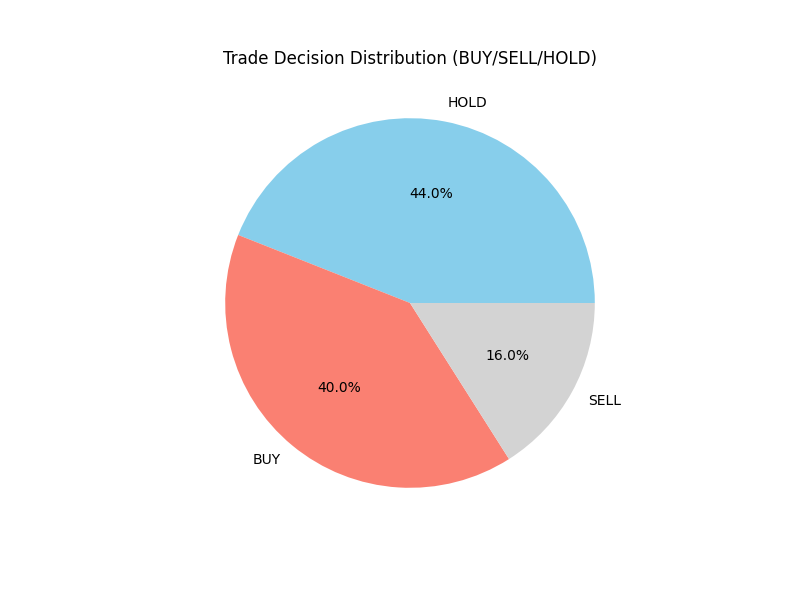
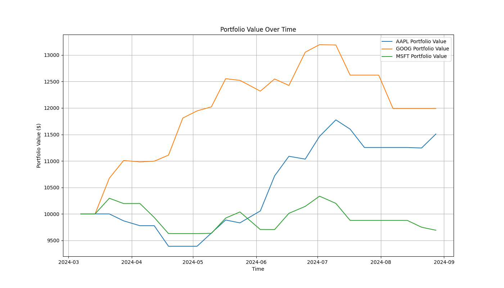

# Layered Memory Trader

This project implements a multi-agent trading bot that uses a layered memory system to make trading decisions. The agents, each with a unique personality and risk profile, debate their decisions to reach a consensus. The system is designed for backtesting on historical data.

## Inspiration

This project is inspired by the paper ["TradingGPT: Multi-Agent System with Layered Memory and Distinct Characters for Enhanced Financial Trading Performance"](https://arxiv.org/abs/2309.03736), which explores the use of cognitive architectures in developing autonomous trading agents. Our implementation of a multi-agent system with layered memory and a debate mechanism draws upon the concepts presented in this research.

## Features

- **Multi-Agent System:** Utilizes a team of agents with different time-horizon specializations (short, mid, long-term).
- **Layered Memory:** Maintains short, mid, and long-term memory buffers for a comprehensive market view.
- **Semantic Memory:** Employs a FAISS-based semantic memory for searching qualitative data like news and reflections.
- **Debate Mechanism:** Agents debate their findings to arrive at a collective trading decision.
- **Reflection:** Agents reflect on their decisions, and these reflections are stored for later analysis.
- **Backtesting Framework:** Built to test strategies on historical data, with a clear separation of training and testing periods.
- **Performance Evaluation:** Includes a script to evaluate the bot's performance based on quantitative and qualitative metrics.

## How It Works

1.  **Data Ingestion:** The `DataManager` loads historical price data for a specified ticker.
2.  **Memory Update:** The `MemoryManager` updates the short, mid, and long-term memory buffers with the latest data.
3.  **Agent Analysis:** Each agent analyzes the memory snapshot and, in the case of the `LongTermAgent`, queries the `SemanticMemory` for relevant context.
4.  **Voting & Debate:** The agents cast their votes (`BUY`, `SELL`, `HOLD`) with a confidence score. The `Debate` class resolves these votes into a final decision.
5.  **Reflection:** The outcome of the decision is simulated, and a reflection is generated and stored.
6.  **Evaluation:** The `evaluate.py` script analyzes the stored reflections to gauge the performance of the trading strategy.

## Results

The system's performance is evaluated through comprehensive backtesting and analysis. Below are the key results from the evaluation:

### Decision Distribution

The following chart shows how the trading decisions are distributed across BUY, SELL, and HOLD actions:



### Portfolio Performance

This chart compares the performance of our multi-agent trading system against a simple "Buy and Hold" benchmark strategy:



The evaluation generates detailed performance metrics including:
- **Sharpe Ratio:** Risk-adjusted return measurement
- **Maximum Drawdown:** Largest peak-to-trough decline
- **Final Portfolio Value:** Compared against buy-and-hold benchmark
- **Trade Log:** Complete record of all trading decisions and outcomes

For detailed performance metrics, see the generated `documentation/results/summary_report.md` after running the evaluation.

## Getting Started

### Prerequisites

- Python 3.8+
- The required packages listed in `requirements.txt`

### Installation

1.  Clone the repository:
    ```bash
    git clone https://github.com/your-username/LayeredMemoryTrader.git
    cd LayeredMemoryTrader
    ```
2.  Install the dependencies:
    ```bash
    pip install -r requirements.txt
    ```

### Usage

1.  **Download Historical Data:**
    Run the following command to download historical data for a stock (e.g., AAPL). This will create/update the `historical_data.csv` file.
    ```bash
    python scripts/download_historical_data.py
    ```

2.  **Run a Backtest:**
    To run a backtest on the training or testing data, you can run the `trader.py` script. By default, it runs on the training data.
    ```bash
    python trader.py
    ```
    You can also modify `trader.py` to run on the test data.

3.  **Evaluate Performance:**
    To evaluate the performance of a backtest run, execute the `evaluate.py` script:
    ```bash
    python evaluate.py
    ```
    This will run a backtest on the test data and then print a performance summary.
