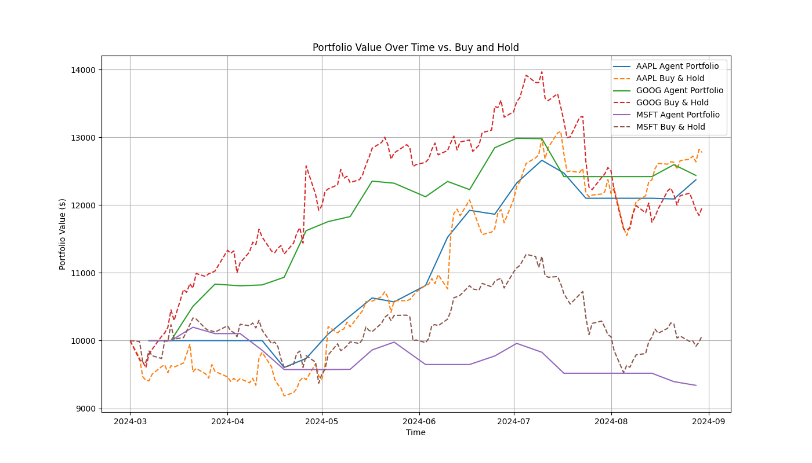

# Layered Memory Trader

This project implements a multi-agent trading bot that uses a layered memory system to make trading decisions. The agents, each with a unique personality and risk profile, debate their decisions to reach a consensus. The system is designed for backtesting on historical data.

## Inspiration

This project is inspired by the paper ["TradingGPT: Multi-Agent System with Layered Memory and Distinct Characters for Enhanced Financial Trading Performance"](https://arxiv.org/abs/2309.03736), which explores the use of cognitive architectures in developing autonomous trading agents. Our implementation of a multi-agent system with layered memory and a debate mechanism draws upon the concepts presented in this research.

## Features

- **Multi-Agent System:** Utilizes a team of agents with different time-horizon specializations (short, mid, long-term).
- **Layered Memory:** Maintains short, mid, and long-term memory buffers for a comprehensive market view.
- **Semantic Memory:** Employs a FAISS-based semantic memory for searching qualitative data like news and reflections.
- **News Integration:** Fetches and integrates historical news data for enhanced decision-making.
- **Debate Mechanism:** Agents debate their findings to arrive at a collective trading decision.
- **Reflection:** Agents reflect on their decisions, and these reflections are stored for later analysis.
- **Backtesting Framework:** Built to test strategies on historical data, with a clear separation of training and testing periods.
- **Performance Evaluation:** Includes a script to evaluate the bot's performance based on quantitative and qualitative metrics.

## How It Works

1.  **Data Ingestion:** The `DataManager` loads historical price data and news data for specified tickers.
2.  **Memory Update:** The `MemoryManager` updates the short, mid, and long-term memory buffers with the latest data.
3.  **News Processing:** News data is stored in semantic memory for contextual analysis.
4.  **Agent Analysis:** Each agent analyzes the memory snapshot and, in the case of the `LongTermAgent`, queries the `SemanticMemory` for relevant news context.
5.  **Voting & Debate:** The agents cast their votes (`BUY`, `SELL`, `HOLD`) with a confidence score. The `Debate` class resolves these votes into a final decision.
6.  **Reflection:** The outcome of the decision is simulated, and a reflection is generated and stored.
7.  **Evaluation:** The `evaluate.py` script analyzes the stored reflections to gauge the performance of the trading strategy.

## Results

The system's performance is evaluated through comprehensive backtesting and analysis. Below are the key results from the evaluation:

### Decision Distribution

The following chart shows how the trading decisions are distributed across BUY, SELL, and HOLD actions:


### Portfolio Performance

This chart compares the performance of our multi-agent trading system against a simple "Buy and Hold" benchmark strategy:



The evaluation generates detailed performance metrics including:
- **Sharpe Ratio:** Risk-adjusted return measurement
- **Maximum Drawdown:** Largest peak-to-trough decline
- **Final Portfolio Value:** Compared against buy-and-hold benchmark
- **Trade Log:** Complete record of all trading decisions and outcomes

For detailed performance metrics, see the generated `documentation/results/summary_report.md` after running the evaluation.

## Getting Started

### Prerequisites

- Python 3.8+
- The required packages listed in `requirements.txt`

### Installation

1.  Clone the repository:
    ```bash
    git clone https://github.com/your-username/LayeredMemoryTrader.git
    cd LayeredMemoryTrader
    ```
2.  Install the dependencies:
    ```bash
    pip install -r requirements.txt
    ```

### News Data Setup (Optional)

The system can work with or without real news data. For enhanced decision-making, you can set up free news APIs:

#### Free News Data Sources

1. **NewsAPI** (Recommended)
   - **Free Tier**: 100 requests/day
   - **Signup**: https://newsapi.org/register
   - **Features**: Historical news search, multiple sources

2. **Alpha Vantage**
   - **Free Tier**: 500 requests/day
   - **Signup**: https://www.alphavantage.co/support/#api-key
   - **Features**: News sentiment analysis, financial news

#### Setup Instructions

1. **Get API Keys**:
   - Sign up for free accounts at the links above
   - Copy your API keys

2. **Configure Environment Variables**:
   Create a `.env` file in your project root:
   ```bash
   # News API Keys
   NEWSAPI_KEY=your_newsapi_key_here
   ALPHA_VANTAGE_KEY=your_alpha_vantage_key_here
   
   # Existing keys
   GEMINI_API_KEY=your_gemini_key_here
   ```

3. **Download News Data**:
   ```bash
   python scripts/download_news_data.py
   ```

**Note**: If you don't set up API keys, the system will create placeholder news data and function normally.

### Usage

1.  **Download Historical Data:**
    Run the following command to download historical data for stocks. This will create/update the `historical_data.csv` file.
    ```bash
    python scripts/download_historical_data.py
    ```

2.  **Download News Data (Optional):**
    If you have API keys set up, download news data:
    ```bash
    python scripts/download_news_data.py
    ```

3.  **Run a Backtest:**
    To run a backtest on the training or testing data, you can run the `trader.py` script. By default, it runs on the training data.
    ```bash
    python trader.py
    ```
    You can also modify `trader.py` to run on the test data.

4.  **Evaluate Performance:**
    To evaluate the performance of a backtest run, execute the `evaluate.py` script:
    ```bash
    python evaluate.py
    ```
    This will run a backtest on the test data and then print a performance summary.

### API Limits and Best Practices

- **NewsAPI**: 100 requests/day, 1 request/second
- **Alpha Vantage**: 500 requests/day, 5 requests/minute
- Start with small date ranges for testing
- Monitor your API usage
- Consider upgrading to paid tiers for more data

### Troubleshooting

- **"API key not found"**: Check your `.env` file exists and API key names are correct
- **"No news found"**: Verify API keys are valid and ticker symbols are correct
- **Rate limiting errors**: Wait a few minutes before retrying or reduce the number of tickers
