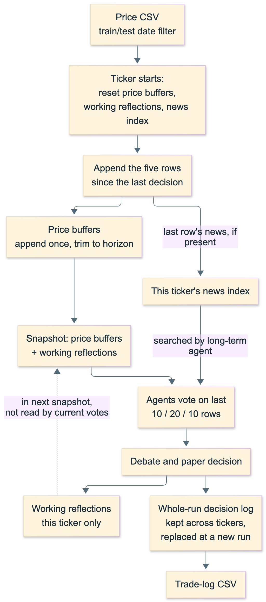

# Replay memory diagram



Each ticker gets empty working stores. Decision rows also enter a whole-run log, which survives ticker changes. Reflections are included in snapshots, but the current agents do not read them. The diagram covers memory flow, not every provider failure or trading calculation.

Editable source: [replay-memory.mmd](replay-memory.mmd). Exports: [PNG](replay-memory.png) and [SVG](replay-memory.svg).

Render from the repository root with Mermaid CLI 12.0.0:

```sh
mmdc -i diagrams/replay-memory.mmd -o diagrams/replay-memory.png -c diagrams/mermaid.json --size 1600 -s 2 -b white
mmdc -i diagrams/replay-memory.mmd -o diagrams/replay-memory.svg -c diagrams/mermaid.json --size 1600 -b white
```

When using an existing Chrome installation, add `-p /path/to/puppeteer.json`; that local JSON file should set `executablePath` to the browser executable. Keep machine-specific configuration outside the repository.

Alt text: Each ticker resets its price buffers, working reflections and news index. Five new price rows enter the buffers; available news from the last row enters the index. Agent votes feed a paper decision, whose reflection goes into both the next snapshot and a separate whole-run log. The log supplies the trade-log CSV.
